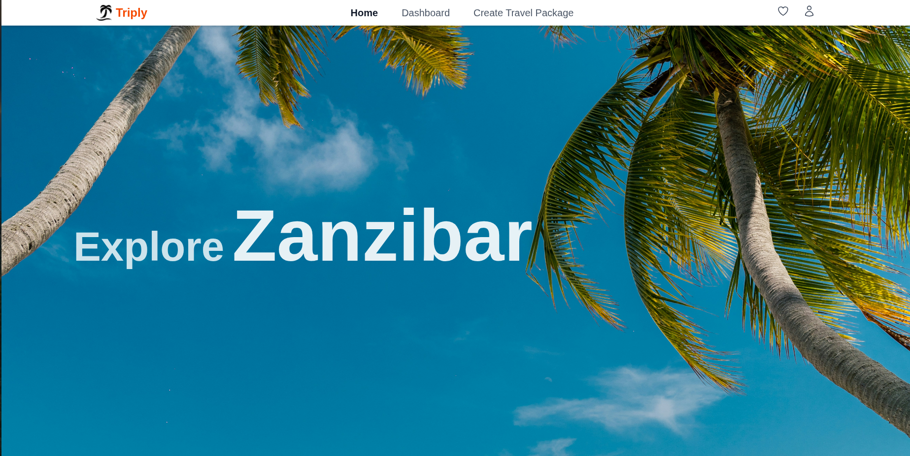

# Triply - Laravel Trip Planner

A centralized trip planning application for organizing and managing travel packages with integrated booking and payment systems.



## Features

- **User Authentication** - Registration, login, and email verification
- **Trip Management** - Browse, search, and manage travel packages with image galleries
- **Shopping Cart** - Add trips to cart before booking
- **Wishlist** - Save favorite trips for later
- **Booking System** - Book trips with automatic pricing for adults/children
- **Payment Integration** - M-Pesa and Stripe payment processing
- **Ratings & Reviews** - Rate and review trips
- **Admin Dashboard** - Analytics, user management, and trip oversight
- **User Dashboard** - Track personal bookings and trip statistics

---

## Requirements

- **PHP** >= 8.2
- **Composer** - Latest version
- **Node.js** >= 18.x
- **npm** - Latest version
- **MySQL** >= 8.0

---

## Installation & Setup

### 1. Clone and Install Dependencies
```bash
git clone <repo-link>
cd triply
composer install
npm install
```

### 2. Configure Environment
```bash
cp .env.example .env
php artisan key:generate
```

Update `.env` with your database credentials:
```env
DB_DATABASE=triply
DB_USERNAME=root
DB_PASSWORD=your_password
```

**Optional - Payment Integration:**
```env
STRIPE_KEY=your_stripe_key
STRIPE_SECRET=your_stripe_secret

MPESA_CONSUMER_KEY=your_mpesa_consumer_key
MPESA_CONSUMER_SECRET=your_mpesa_consumer_secret
MPESA_SHORTCODE=your_shortcode
MPESA_PASSKEY=your_passkey
```

### 3. Setup Database
```bash
# Create database
mysql -u root -p -e "CREATE DATABASE triply;"

# Run migrations and seeders
php artisan migrate --seed
```

### 4. Build Assets and Start Server
```bash
npm run build
php artisan serve
```

Visit: [http://127.0.0.1:8000](http://127.0.0.1:8000)

---

## Development Mode

Run all services concurrently:
```bash
composer run dev
```

This starts:
- Laravel server
- Queue worker
- Laravel Pail logs
- Vite dev server (hot-reload)

---

## Technology Stack

- Laravel 12.x
- Livewire 3.6
- Tailwind CSS 4.x
- MySQL 8.0+
- Stripe & M-Pesa
- Cloudinary (image hosting)

---

## Contributors

- **Ivy Lynn** - 175793
- **Richie Mwangi** - 189293
- **Joseph Kinyuru** - 167600
- **Jean Njoroge** - 187923
- **Laureen Aiko** - 191876
- **Vanessa Onyango** - 190378
